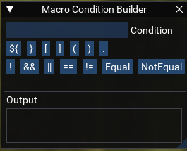
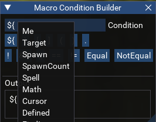
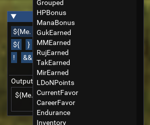
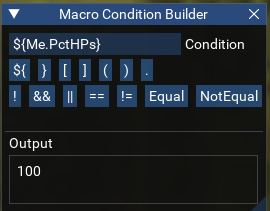

# Macro Condition Builder

This script provides an interface to help with building macro expressions for use with macros such as KissAssist or MuleAssist.

## Usage

Place `condbuilder.lua` into your lua folder.  
Run `/lua run condbuilder`

